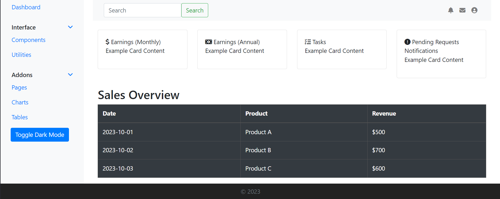
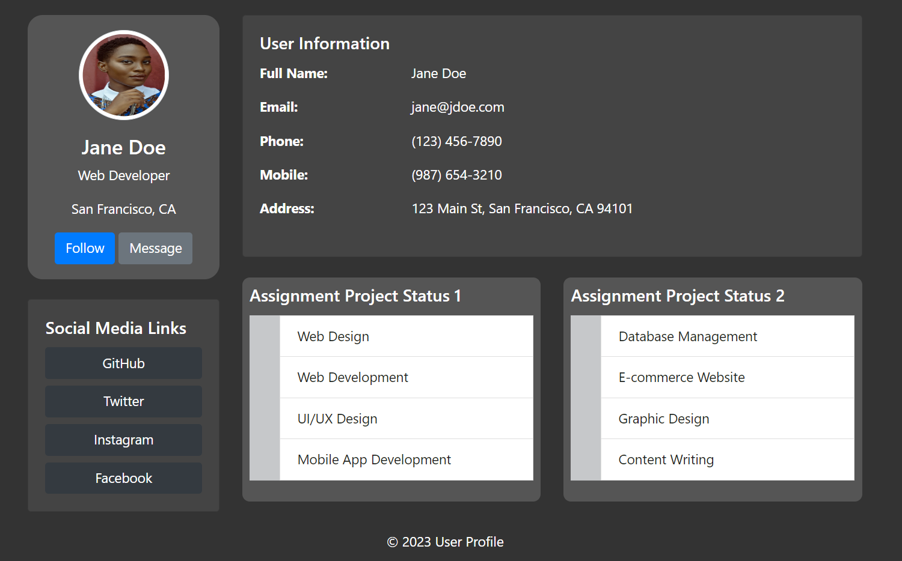

# Admin and User Bootstrap Pages
Simple admin and user pages built using Bootstrap. Per Scholas Bootstrap assignment.

# Contents
####  User
- User Wireframe
- User Page

#### Admin 
- Admin Wireframe
- Admin Page

# Admin Wireframe

# Admin Page

# User Wireframe

# User Page

# Getting Started
Clone the repo to check out the pages.